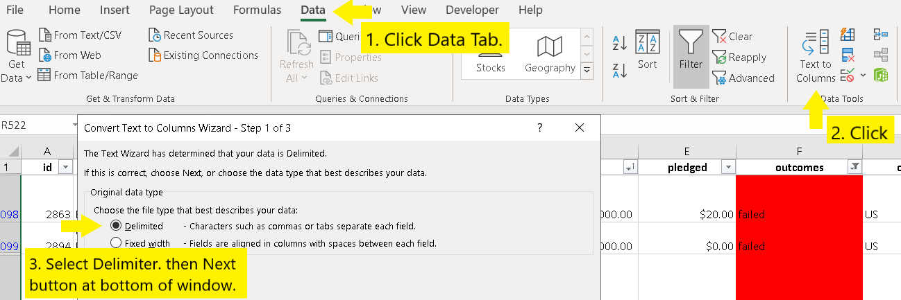
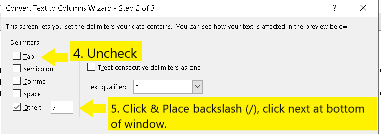
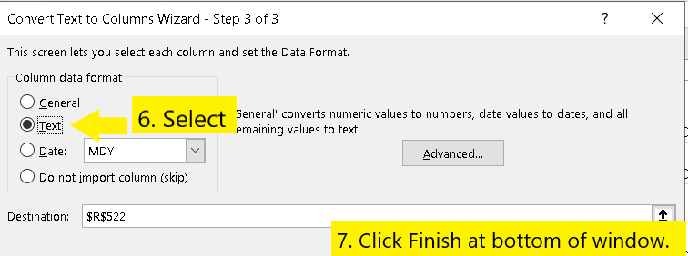

# Kickstarting with Excel

## Overview of Project

In this project, we assisted a promising playright, Louise, who wants to Finance her play 'Fever'.  She approximates a budget of over $10,000.  This project uses excel to order, classify, and study crowdfunding data to determine if there are specific elements that make a project campaign successful.  This project provides Louise with information regarding specific elements that will help her set-up successful campaigns of the same category type.  

### Purpose

The purpose of this analysis is to determine how different campaigns fared in relation to their launch dates and fundraising goals. We provide Louise with not just data, but also written analysis and visualizations to help her understand how to incorporate components from other campaigns to provide the greatest level of success in her own.

## Analysis and Challenges

### Analysis of Outcomes Based on Launch Date

To perform the analysis of Outcomes based on Launch Date, we first made all the data readable.  This involved changing the deadline and Launched-at columns from Unix timestamps to dates in a standard fromat.  Next we added conditional formatting on the four categories in the Outcome column: Successful, Failed, Canceled, and Live.  We formatted them each to be highlighted a specific color based on the outcome.  

From there we put subcategories into their own column.  This was done by using the "Convert Text to Columns Wizard". 

                                           

### Analysis of Outcomes Based on Goals

One of the first things we did was add filters to this data, this allows us to omit data that doesn't pertain or focus in on specific data.  We sorted the Pledged and Goal Columns from highest to lowest to put them in some semblance of order. 

### Challenges and Difficulties Encountered

## Results

- What are two conclusions you can draw about the Outcomes based on Launch Date?

- What can you conclude about the Outcomes based on Goals?

- What are some limitations of this dataset?

- What are some other possible tables and/or graphs that we could create?
